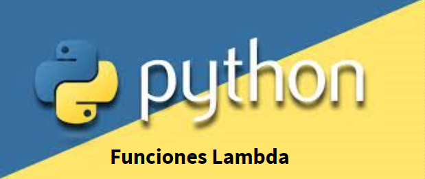

# Funciones Lambda y bucles avanzados en Python
###Ejercicios que incluyen funciones lambda y bucles avanzados

This repository contains a collection of lambda exercises developed during the Upgrade Hub classes. These exercises cover a variety of topics, including functions, lambda expressions and more.

## Contents

- **Exercise 1:** Determine if a number is even or odd.
- **Exercise 2:** Show odd numbers up to a given number.
- **Exercise 3:** Count the vowels in a string of text.
- **Exercise 4:** Find the largest number in a list of numbers.
- **Exercise 5:** Count even and odd numbers in a randomly generated list.
- **Exercise 6:** Reverse a string of text.
- **Exercise 7:** Sum all numbers in a list.
- **Exercise 8:** Determine if a word is a palindrome.
- **Exercise 9:** Count the number of occurrences of a word in a string of text.
- **Exercise 10:** Filter words starting with a specific letter in a list.
- **Exercise 11:** Function to get the domain of an email.
- **Exercise 12:** Function to check if a word contains the word 'dog'.
- **Exercise 13:** Function to count the number of occurrences of the word 'dog' in a string of text.
- **Exercise 14:** Filter words in a list starting with a specific letter using list comprehensions.
- **Exercise 15:** Control user input and matrix operations.

Each section provides a description of the exercise and its corresponding solution. This summary gives an overview of the concepts and skills addressed in each exercise.